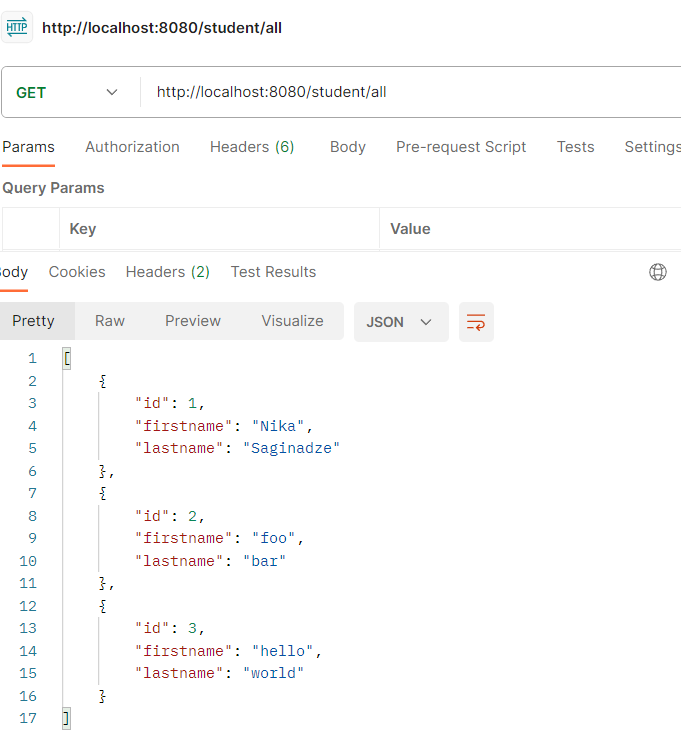
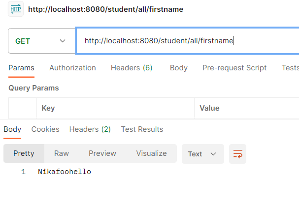

# WebFlux unexpected behaviour
## Description
The call to `getAllEmployees` produces JSON with the list of all the student objects, while the call to `getAllEmployeeFirstnames` produces a single concatenated string of first names. In theory, the latter should have returned a JSON with the list of first names
```java
@GetMapping("/all")
public Flux<Student> getAllEmployees() {
    return studentRepository.getAllStudents();
}
```

```java
@GetMapping("/all/firstname")
public Flux<String> getAllEmployeeFirstnames() {
    return studentRepository.getAllStudents()
        .map(Student::getFirstname);
}
```


